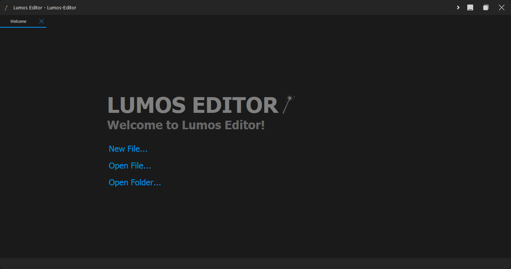
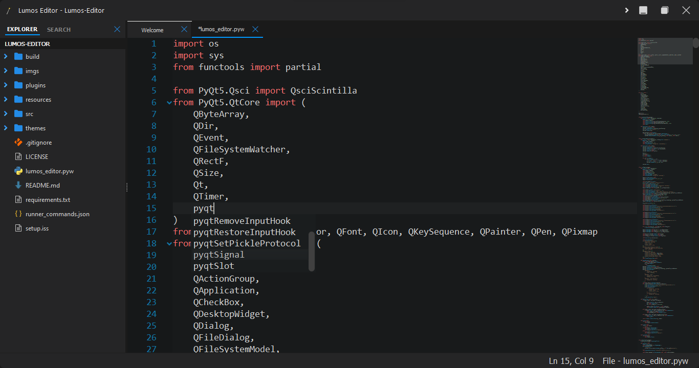
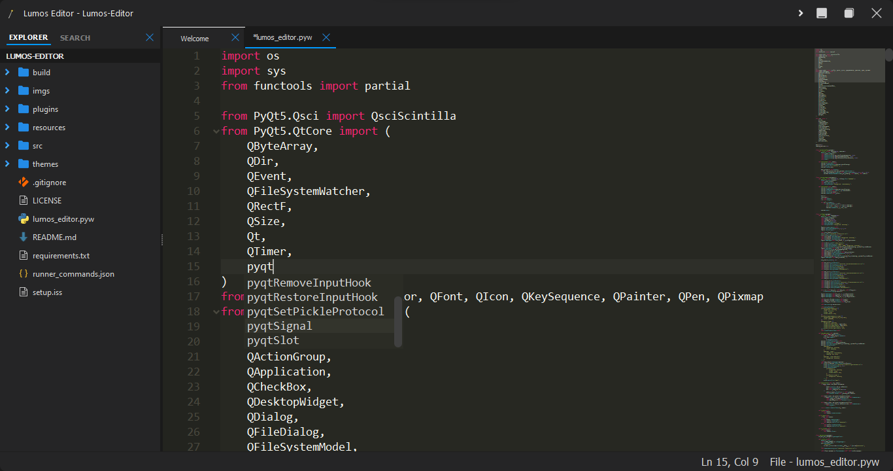
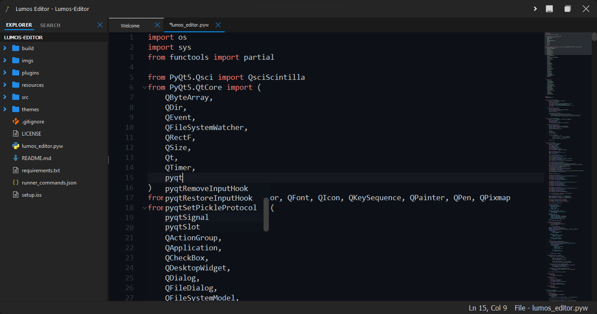
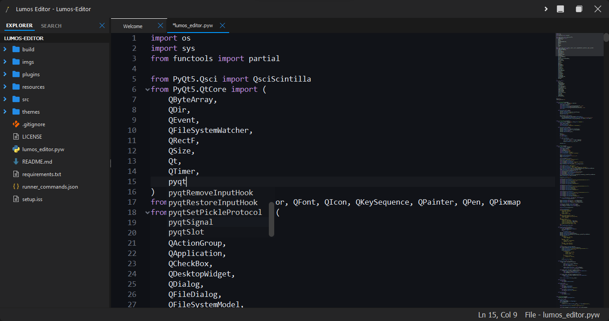
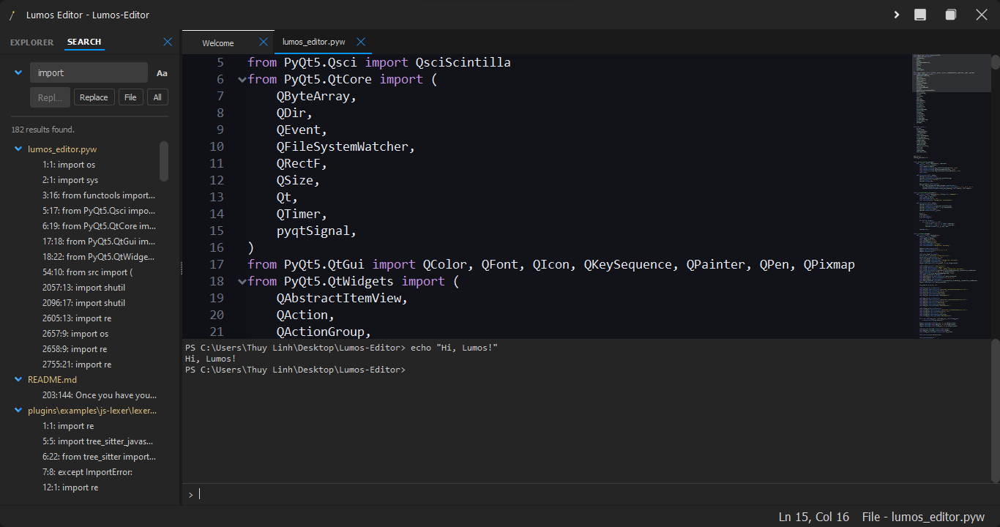

<p align="center">
    
</p>

<h1 align="center">Lumos Editor</h1>

<p align="center">A modern, extensible code editor built with PyQt5.<p>

<p align="center">
    <a href="https://opensource.org/licenses/MIT">
        
    </a>
    <a href="https://github.com/memecoder12345678/lumos-editor/releases">
        
    </a>
    <a href="https://www.python.org/">
        
    </a>
    <a href="https://riverbankcomputing.com/software/pyqt/">
        
    </a>
    <a href="https://github.com/memecoder12345678/lumos-editor/stargazers">
        
    </a>
</p>

A modern, extensible code editor built with PyQt5, featuring syntax highlighting, file tree navigation, Markdown preview, and a flexible plugin system.

## Screenshots







 
## Features

-   **Clean, Modern UI:** A sleek dark theme designed for focus and comfort.
-   **Powerful Plugin System:** Extend the editor with custom syntax highlighters, new functionality, menu items, and event hooks.
-   **Source Control Integration:** Manage your Git repositories directly within the editor with a dedicated source control panel.
-   **AI Chat Assistant:** Get instant coding help, generate code, and ask questions with an integrated AI chat powered by Gemini.
-   **Advanced File Explorer:** Navigate your project with a file tree that supports file operations (create, rename, delete, copy, cut, paste, drag & drop).
-   **Multi-Tab Editing:** Work on multiple files simultaneously with a movable and closable tab system.
-   **Markdown Preview:** Instantly preview your Markdown files, with support for embedded images and syntax-highlighted code blocks.
-   **Media Viewer:** Open and view common image, audio, and video formats directly in the editor.
-   **Integrated Terminal:** Run shell commands without leaving the editor, with cross-platform support.
-   **Customizable Themes:** Choose from built-in themes or create your own by defining color schemes in JSON files.
-   **Search/Replace:** Find and replace text within files or across your entire project.
 
## Installation

1.  **Clone this repository:**
    ```sh
    git clone https://github.com/memecoder12345678/lumos-editor.git
    cd lumos-editor
    ```

2.  **Install dependencies:**
    ```sh
    pip install -r requirements.txt
    ```

3.  **(Optional) Install Plugins:**
    -   Create a `plugins` folder in the root directory.
    -   Download `.lmp` files and place them inside the [plugins](plugins) folder.
    -   If plugins require additional Python packages, install them using `pip install package-name`. (Make sure to only install packages from trusted sources!)

4. **(Optional) Add Custom Themes:**
    -   Create a `themes/your-theme` folder in the root directory.
    -   Add your custom `theme.json` theme files to the [themes](themes) folder.

5.  **Run the editor:**
    ```sh
    python lumos_editor.pyw
    ```

## Performance Notes
Lumos Editor is optimized for performance, but keep in mind that it may consume more resources than simpler text editors due to its rich feature set and plugin system. For the best experience, it's recommended to run Lumos Editor on a machine with at least 8GB of RAM and a modern CPU, and always keep it plugged in if you're using a laptop.
 
## Plugin System

Lumos Editor supports a powerful plugin system that allows for extending the editor's functionality. You can enable, disable, or manage your installed plugins via the `Plugins` menu.

> [!WARNING]
> **Security Warning:** Plugins are executed with the same permissions as the editor itself. For your security, **only install plugins from sources you trust**. Lumos Editor cannot guarantee the safety or integrity of third-party plugins.

### Plugin Concepts

Plugins are packaged as `.lmp` files (which are standard `.zip` archives). Each plugin is defined by a `manifest.json` file at its root.

#### The `manifest.json` File

This file contains metadata that describes the plugin and its capabilities.

| Field | Type | Required? | Description |
| :--- | :--- | :--- | :--- |
| **`name`** | String | Yes | The display name of the plugin. |
| **`pluginType`** | String/Array | No | Specifies the plugin's capabilities. Can be `"language"`, `"hook"`, or `"both"`. If omitted, it will be inferred based on the presence of extensions. |
| **`mainFile`** | String | No | The entry point script for logic and hooks. Defaults to `"plugin.py"` if not specified. |
| **`lexerFile`** | String | No | The script file containing the lexer class for language support. Defaults to `"lexer.py"` if not specified. |
| **`fileExtensions`** | Array | For `language` plugins | An array of file extensions this plugin applies to (e.g., `[".js", ".mjs"]`). |
| **`iconFile`** | String | For `language` plugins | The path to the file icon within the archive (e.g., "icons/js.png"). |
| **`lexerClass`** | String | For `language` plugins | The name of the custom lexer class defined within the `lexerFile` (or `mainFile`). |

### Hook Plugin Execution Context

For plugins of type `"hook"` or `"both"`, the specified `mainFile` is executed in a special context where several APIs and helper functions are automatically injected and available for use.

### The Lumos API

>
> Tip: If you're new to plugin development, start by exploring the [example plugin](./plugins/examples/) included in this repository. It demonstrates how to use the Lumos API to create a simple plugin that adds a menu item and responds to editor events.
>

The Lumos API provides a powerful and secure interface for integrating your plugins with the editor. All interactions are funneled through the `lumos` object, which is automatically injected into your plugin's global scope. This object serves as the single entry point for accessing all managers, helper functions, and base classes.

#### Injected API Object

-   **`lumos`**: The global `LumosAPI` instance. This is the primary object for accessing all plugin functionality. It recursively wraps and provides access to the `plugin_manager`, `config_manager`, `BaseLexer`, and all helper functions.
 
### API Components

#### `lumos.plugin_manager` API

The `plugin_manager` is the primary object for registering plugin functionality and integrating with the editor's UI.

| Method | Description |
| :--- | :--- |
| **`register_hook(event_name: str, func: callable)`** | Registers a callback function to be executed when a specific editor event occurs. The `event_name` determines when the function is called, and arguments are passed as keyword arguments (`**kwargs`). |
| **`add_menu_action(menu_name: str, text: str, callback: callable, shortcut: str = None, checkable: bool = False, add_separator: bool = False)`** | Adds a new clickable action to one of the main menus of the editor. `menu_name` is the name of the target menu (e.g., "File", "Tools"). |

> [!WARNING]
> When using `add_menu_action`, ensure that the `menu_name` corresponds to an existing
> top-level menu in the editor. Adding actions to non-existent menus will result in an error. The available menu names are: "File", "Edit", "View", "Tools", and "Plugins".
> Please also always use try-except blocks when calling this function to prevent your plugin from crashing the editor if an error occurs.

##### **Available Hooks (`register_hook` Events)**
The following events are available for plugins to hook into. Your callback function will receive the listed arguments as keyword arguments.

| Event Name        | Description                                           | Arguments Passed (**kwargs**)                                                                                                  |
| :---------------- | :---------------------------------------------------- | :----------------------------------------------------------------------------------------------------------------------------- |
| **`folder_opened`** | Triggered when a project folder is successfully opened. | - `folder_path` (str): The absolute path of the opened folder.                                                              |
| **`folder_closed`** | Triggered just before a project folder is closed.     | - `folder_path` (str): The absolute path of the folder being closed.                                                        |
| **`file_opened`**   | Triggered after a file is opened and its tab is created.  | - `filepath` (str): The absolute path of the opened file.<br>- `tab` (QWidget): The newly created tab instance (e.g., `EditorTab`). |
| **`file_closed`**   | Triggered just before a file's tab is closed.         | - `filepath` (str): The absolute path of the file being closed.<br>- `tab` (QWidget): The tab instance about to be closed.     |

#### `lumos.config_manager` API
The `config_manager` allows the plugin to read and write persistent settings to the editor's `config.json`.

| Method | Description |
| :--- | :--- |
| **`get(key: str, default: Any = None) -> Any`** | Retrieves a configuration value by its key. Returns `default` if the key does not exist. |
| **`set(key: str, value: Any)`** | Sets a configuration value for the specified key. |
| **`is_plugin_enabled(plugin_filename: str) -> bool`** | Checks if a specific plugin is enabled based on its filename. |
| **`set_plugin_enabled(plugin_filename: str, is_enabled: bool)`** | Enables or disables a specific plugin by its filename. |

The following configuration keys are predefined and managed internally by the `config_manager` object:

| Key                      | Type       | Description                                                                              |
| :----------------------- | :--------- | :--------------------------------------------------------------------------------------- |
| **`plugins_enabled`**    | Boolean    | Global toggle for enabling or disabling all plugins.                                     |
| **`individual_plugins`** | Dictionary | A mapping of plugin filenames to their enabled/disabled status.                          |
| **`wrap_mode`**          | Boolean    | Indicates whether line-wrap mode is enabled in the editor.                               |
| **`theme`**              | String     | Name of the currently active editor theme (e.g., `"dark"`, `"light"`, `"solarized"`).    |
| **`recent_files`**       | List       | A list of recently opened files, ordered from most recent to least recent.               |

#### `lumos.PygmentsBaseLexer` and `lumos.BaseLexer` Class

-   The `PygmentsBaseLexer` class is a wrapper around Pygments lexers that allows them to be used as syntax highlighters within Lumos Editor. By inheriting from this class, plugin developers can create custom lexers for new programming languages or file formats.
-   The `BaseLexer` class is a flexible base class for creating custom lexers, allowing you to define your own tokenization logic without relying on Pygments. This can be especially useful for languages or formats that are not well-supported by existing Pygments lexers, or if you want to implement unique syntax highlighting features. Use this class if you aim to enhance the performance of your lexer, but keep in mind that you will need to develop the tokenization logic yourself, which can be complex for certain languages.
-   For more details on how to create a custom lexer, see the [example JavaScript lexer plugin](./plugins/examples/js-lexer/) or the [lexer implementation used in this editor](./src/lexer.py).

#### Helper Functions (accessed via `lumos`)

These functions provide a safe and convenient way for plugins to interact with the user and the file system within the context of the currently open project.

| Function | Description |
| :--- | :--- |
| **`get_project_dir() -> str \| None`** | Returns the absolute path of the currently open project folder. Returns `None` if no project is open. |
| **`create_project_file(relpath: str, content: str = "") -> str`** | Creates a new file (or overwrites an existing one) at `relpath` relative to the project root. Raises `RuntimeError` on failure. |
| **`write_project_file(relpath: str, content: str) -> str`** | An alias for `create_project_file`. |
| **`read_project_file(relpath: str) -> str`** | Reads and returns the content of a file at `relpath` relative to the project root. Raises `RuntimeError` on failure. |
| **`delete_project_file(relpath: str) -> bool`** | Deletes a file or directory at `relpath` relative to the project root. Raises `RuntimeError` on failure. |
| **`show_message(title: str, message: str)`** | A simple wrapper to display an informational `QMessageBox` to the user. |
| **`show_warning(title: str, message: str)`** | A simple wrapper to display a warning `QMessageBox` to the user. |
| **`show_error(title: str, message: str)`** | A simple wrapper to display an error `QMessageBox` to the user. |
| **`ask_yn_question(title: str, question: str) -> bool`** | Displays a yes/no question dialog and returns `True` if the user selects "Yes", otherwise `False`. |
| **`ask_text_input(title: str, label: str, default: str = "") -> str \| None`** | Displays a text input dialog and returns the entered string. Returns `None` if the user cancels. |
| **`get_current_file() -> str \| None`** | Returns the absolute file path of the currently active file tab. Returns `None` if no file is open or if the current tab is a new, unsaved file. |
| **`is_file() -> bool`** | Checks if the currently active tab represents a saved file on disk. Returns `True` if a saved file is active, otherwise `False`. |
| **`get_editor_text() -> str \| None`** | Gets all the text from the currently active editor tab. Returns the content as a string, or `None` if no editor is active. |
| **`set_editor_text(text: str) -> bool`** | Replaces the entire content of the active editor with the provided `text`. Returns `True` on success, `False` if no editor is active. |
| **`is_saved() -> bool`** | Checks if the active file tab has unsaved changes. Returns `True` if the file is saved or no file is active, `False` if there are unsaved modifications. |
| **`run_cmd_in_terminal(cmd: str) -> bool`** | Executes a shell command in the editor's integrated terminal panel. The terminal will automatically open if it's not already visible. Returns `True` on success, `False` on failure. |

> [!WARNING]
> Don't try to access the editor's UI elements or internal state directly from your plugin code. Always use the provided APIs and helper functions to ensure compatibility and stability. Direct access can lead to unexpected behavior and may break with future updates of the editor.

### Packaging the Plugin

Once you have your files (`manifest.json`, `plugin.py`, icons, etc.), select all of them, right-click, and compress them into a `.zip` file. **Important:** Do not zip the parent folder, only the files themselves.

Rename the final `.zip` file to have a `.lmp` extension (e.g., `my-plugin.lmp`). Drop it in the [plugins](plugins) folder and restart the editor.

## Keyboard Shortcuts

### File

| Shortcut | Action |
| :--- | :--- |
| `Ctrl+N` | New File |
| `Ctrl+O` | Open File |
| `Ctrl+Shift+O` | Open File in Split View |
| `Ctrl+K` | Open Folder |
| `Ctrl+Shift+K` | Close Folder |
| `Ctrl+S` | Save |
| `Ctrl+Shift+S` | Save As... |
| `Ctrl+R` | Restart |
| `Ctrl+Q` | Exit |

### Edit

| Shortcut | Action |
| :--- | :--- |
| `Ctrl+Z` | Undo |
| `Ctrl+Y` | Redo |
| `Ctrl+X` | Cut |
| `Ctrl+C` | Copy |
| `Ctrl+V` | Paste |
| `Ctrl+A` | Select All |
| `Ctrl+F` | Find (in File) |
| `Ctrl+H` | Replace (in File) |
| `Ctrl+Shift+F` | Find in Files |
| `Ctrl+Shift+H` | Replace in Files |
| `Ctrl+W` | Toggle Wrap Mode |

### View

| Shortcut | Action |
| :--- | :--- |
| `Ctrl+B` | Toggle Explorer Panel |
| `Ctrl+P` | Toggle Markdown Preview |
| <code>Ctrl+`</code> | Toggle Integrated Terminal |

### Tools

| Shortcut | Action |
| :--- | :--- |
| `Ctrl+Shift+A` | Open AI Chat |
| `Ctrl+Shift+G` | Open Source Control |

### Plugins

| Shortcut | Action |
| :--- | :--- |
| `Ctrl+Shift+B` | Enable / Disable Plugins |
| `Ctrl+Shift+M` | Manage Individual Plugins... |

### Command Palette
| Shortcut | Action |
| :--- | :--- |
| `Ctrl+Shift+P` | Open Command Palette |

## Contributing

Pull requests are welcome! For major changes, please open an issue first to discuss what you would like to change.

## Credits

-   Original idea from: [https://github.com/Fus3n/pyqt-code-editor-yt](https://github.com/Fus3n/pyqt-code-editor-yt)
-   Additional inspiration from VSCode's UI/UX

## License

[MIT](https://choosealicense.com/licenses/mit/)
